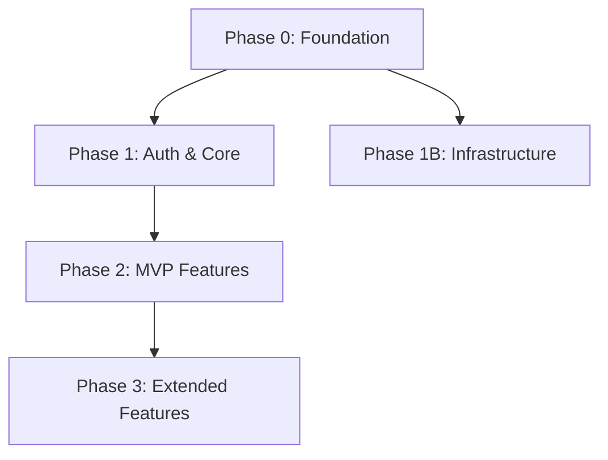

# Generate Implementation Plan

**Phase:** 6
**Input:** All upstream documents through Phase 5
**Output:** `plan/06-implementation-plan/IMPLEMENTATION-PLAN.md`

---

## Instructions

### Step 1: Load All Upstream Context

Read the following files completely before generating anything:
- `plan/01-prd/PRD.md` — full product requirements, especially:
  - Section 6.3 (MVP vs. Full Scope) — MVP scope maps to early phases
  - Section 7 (Functional Requirements) — all requirements must be planned
  - Section 8 (User Flows) — flows define what must be functional at each phase
  - Section 14 (Non-Functional Requirements) — performance and reliability requirements
  - Section 15.1 (Constraints) — timeline and resource constraints
- All files matching `plan/02-adrs/ADR-*.md`
- `plan/03-architecture/TECHNICAL-ARCHITECTURE.md`
- `plan/04-system-design/SYSTEM-DESIGN.md`
- `plan/05-api-and-data/DATA-MODEL.md`
- `plan/05-api-and-data/API-DESIGN.md`
- `.claude/templates/DEVELOPMENT-WORKFLOW.md` — TDD cycle, git workflow, quality gates, definition of done
- `plan/02-adrs/ADR-0002-aas-conformance-level.md` — AAS conformance level
- `.claude/templates/AAS-INTEGRATION-GUIDE.md` — AAS integration guide (Section 5 for phasing, Section 6 for conformance testing)

### Step 2: Identify All Work Items

Catalog every piece of work that must be done:

**Infrastructure and setup work (always Phase 0):**
- Repository initialization with correct structure
- CI/CD pipeline configuration (GitHub Actions or per ADR)
- Git hooks configuration per DEVELOPMENT-WORKFLOW.md (pre-commit: lint, types, secrets scan; pre-push: full tests)
- Development environment configuration
- Deployment pipeline to each environment (dev, staging, production)
- Database setup and migration tooling configuration
- Monitoring and observability setup (error tracking, logging, alerting)
- Secret management setup
- Local development seeding
- AAS conformance test runner setup (download `validate_conformance.py` and test vectors, configure CI gate per AAS-INTEGRATION-GUIDE.md Section 6)

**AAS compliance work (integrated into feature phases, scaled by ADR-0002 conformance level):**

Per AAS-INTEGRATION-GUIDE.md Section 5, AAS work is phased alongside business features:
- **Core AAS work** (earliest feature phase): manifest endpoint, `application/problem+json` error middleware, operation registry, idempotency tracking, nonce handshake
- **Operational AAS work** (subsequent phase, only if level is operational or governed): AXA challenge protocol, challenge catalog, behavioral scoring, delegation tokens, trust tiers, economic controls
- **Governed AAS work** (final AAS phase, only if level is governed): audit chain, attestation endpoint, token revocation, threat model, portability profile, certification metadata

AAS core work SHOULD be in the same phase as authentication and core infrastructure. Operational and governed work should follow in dedicated phases or be integrated into later feature phases.

**Feature work (Phase 1 and beyond):**
- Every functional requirement from PRD Section 7
- Every user flow from PRD Section 8
- Every integration from PRD Section 13.1 (required integrations)
- Security requirements from PRD Section 14.3
- Performance requirements from PRD Section 14.1

**Non-feature work:**
- E2E test suite setup
- Load testing setup (if PRD has performance requirements)
- Documentation
- Optional integrations from PRD Section 13.2 (later phases)

### Step 3: Analyze Dependencies

For every work item, determine:
- What other work items must be complete before this can start
- What this work item unlocks when complete

Build a dependency graph mentally. Work that has no dependencies goes in Phase 0 or Phase 1. Work that depends on other work goes in the phase after its dependencies.

**Hard dependency rules:**
- Phase 0 (project setup) must complete before any feature work begins
- Authentication must be implemented before any endpoint that requires auth
- Database schema must exist before any data access layer
- Core domain entities must exist before related features
- Any third-party integration must be set up before features that depend on it

### Step 4: Define Implementation Phases

Group work items into logical phases. Each phase must:
- Be independently releasable or demoable (delivers real value or capability)
- Have a coherent theme — not a random mix of unrelated work
- Build on the previous phase without requiring future phases to function

**Phase 0: Project Foundation (always first)**

Everything required before writing a single line of feature code:
- Repository and branch protection setup
- CI/CD pipeline (tests, lint, type check, build, deploy)
- Git hooks per DEVELOPMENT-WORKFLOW.md
- All environments provisioned (dev, staging, production)
- Database provisioned and migration tooling configured
- Monitoring stack configured
- Secret management configured
- Local development environment documented and working

Definition of done for Phase 0: A developer can clone the repo, run the setup, and have a working local environment. The CI/CD pipeline is green. Deployments to staging work.

**Phase 1 and beyond: Feature Phases**

Map PRD Section 6.3 (MVP) to the earliest phases. Non-MVP features go in later phases.

For each feature phase:
- Give it a descriptive name (not just "Phase 2")
- List the goals — what user capabilities will exist at the end of this phase
- List features included — specific functional requirements from PRD
- List prerequisites — what must be done before this phase begins
- List deliverables — what will exist when this phase is complete
- Define milestones with TESTABLE criteria (see below)

**Milestone criteria must be specific and testable:**
- Good: "Users can register with email/password and receive a verification email. POST /api/v1/auth/register returns 201. Verification email is delivered within 60 seconds. Invalid email returns 400 with field-level error."
- Bad: "Authentication works" or "Users can sign up"

### Step 5: Estimate Epic Count Per Phase

For each phase, estimate how many epics it will require. An epic is a cohesive chunk of deliverable functionality — typically 2–6 stories. This estimate feeds into Phase 7 (generate-epics).

Consider:
- Each major feature area typically needs 1 epic
- Complex features may need 2 epics (data layer + UI layer, or setup + feature)
- Infrastructure setup in Phase 0 typically generates 2–4 epics

Document the estimate in each phase section.

### Step 6: Build the Dependency Graph

Create a text-based dependency graph showing which phases and major work items block other work items.

Use this format:
```
Phase 0: Project Foundation
  └── Phase 1: Core Infrastructure
        ├── Phase 2: MVP Feature Set
        │     └── Phase 3: Extended Features
        └── Phase 2: [Parallel work if independent]
```

Or use Mermaid:


### Step 7: Build the Risk Register

Identify at least 5 risks. A risk is something that could cause a phase to slip, fail, or require rework. For each risk:

**Risk fields:**
- Description: specific statement of what could go wrong
- Probability: High / Medium / Low — with brief justification
- Impact: High / Medium / Low — on timeline, quality, or scope
- Mitigation: concrete actions to reduce the probability or impact
- Contingency: what to do if the risk materializes

**Risk categories to consider:**
- Technical risks: third-party API limitations, performance bottlenecks, integration complexity
- Schedule risks: underestimated complexity, dependency on external systems
- Quality risks: insufficient test coverage, skipped phase 0 quality gates
- Scope risks: PRD requirements that are ambiguous or underspecified (reference Open Questions from Section 16)
- Security risks: data handling requirements, compliance obligations

### Step 8: Design Testing Strategy Per Phase

For each phase, describe the testing approach aligned with DEVELOPMENT-WORKFLOW.md:

**TDD cycle per story:**
- Red: write failing test first
- Green: implement minimum code to pass
- Refactor: clean up while tests stay green
- Commit: atomic commit when one behavior is complete

**Test types per phase:**
- Phase 0: CI pipeline tests (lint, type check, build verification)
- Feature phases: unit tests, integration tests, API contract tests
- Final phases: E2E tests for critical user flows, load tests if performance requirements exist

**Coverage target:** >80% on all modified code per DEVELOPMENT-WORKFLOW.md

**Quality gates per phase:**
- All tests pass
- Coverage target met
- Lint and type check clean
- No critical security vulnerabilities
- Code reviewed and approved per DEVELOPMENT-WORKFLOW.md
- AAS conformance tests pass at the target level (`python tests/conformance/validate_conformance.py --level <level>`) — gate enforced from the phase where AAS core work is implemented

### Step 9: Generate the Document

Generate `plan/06-implementation-plan/IMPLEMENTATION-PLAN.md`.

**YAML frontmatter:**
```yaml
---
title: "[Application Name] — Implementation Plan"
date: YYYY-MM-DD
version: "1.0"
phase: 6
source_documents:
  - "plan/01-prd/PRD.md"
  - "plan/03-architecture/TECHNICAL-ARCHITECTURE.md"
  - "plan/04-system-design/SYSTEM-DESIGN.md"
  - "plan/05-api-and-data/DATA-MODEL.md"
  - "plan/05-api-and-data/API-DESIGN.md"
---
```

**Required sections:**
1. Overview — number of phases, total work categories, MVP target phase
2. Phase 0: Project Foundation — goals, all setup work, definition of done, estimated epics
3. Phase 1+: Feature phases (as many as needed) — goals, features, prerequisites, deliverables, milestones, testing strategy, estimated epics
4. Dependency Graph — text or Mermaid showing phase and work item dependencies
5. Risk Register — full table with all risks, probability, impact, mitigation, contingency
6. Milestones — consolidated list of all testable milestones across all phases
7. Testing Strategy — TDD cycle, test types per phase, quality gates
8. Functional Requirements Coverage — table mapping every FR-XXX from PRD Section 7 to the phase in which it will be implemented

**The last section (FR coverage) ensures nothing falls through the cracks.**

### Step 10: Update Pipeline State

Update `plan/pipeline-state.json`:
- Set phase 6 `status` to `"complete"`
- Set `completed_at` to current ISO timestamp
- Populate `outputs` with `["plan/06-implementation-plan/IMPLEMENTATION-PLAN.md"]`
- Update `updated_at`

---

## Quality Checks Before Marking Complete

- [ ] Phase 0 covers all infrastructure, CI/CD, and tooling setup
- [ ] PRD Section 6.3 MVP scope maps to the earliest feature phases
- [ ] Every functional requirement from PRD Section 7 appears in the FR coverage table
- [ ] All milestones have specific, testable criteria — no vague "works" statements
- [ ] Risk register has at least 5 risks with concrete mitigations
- [ ] Dependency graph is consistent with the phase ordering
- [ ] Epic count estimates are present for every phase
- [ ] Testing strategy references DEVELOPMENT-WORKFLOW.md TDD cycle
- [ ] AAS conformance test setup is included in Phase 0
- [ ] AAS compliance work items are included in feature phases (core always, operational/governed scaled by ADR-0002)
- [ ] AAS conformance testing appears in CI quality gates
