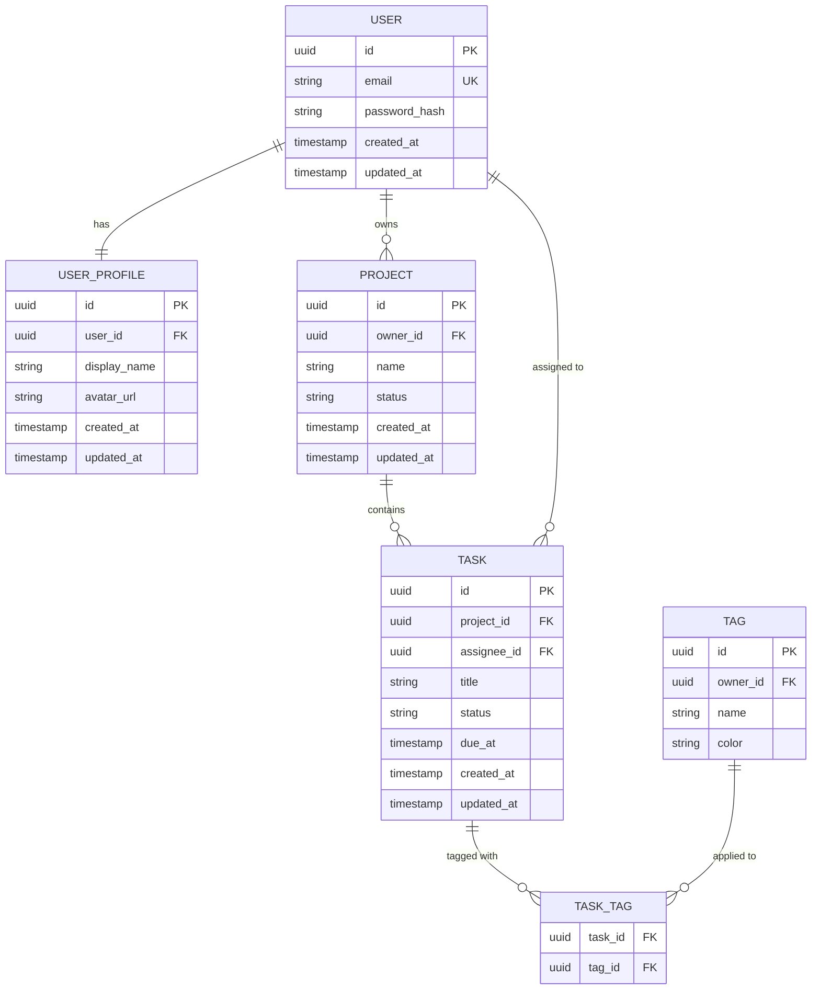

# [Application Name] — Data Model

> **Purpose:** Define the complete data model for the application — every entity, field, relationship, index, and constraint. This document is the source of truth for the database schema. Migrations, ORMs, and API designs are derived from it. Be exhaustive — if it is not here, it does not get built.

---

## 1. Overview

[2–3 sentences describing the data model at a high level. How many primary entities? What is the core domain object the system is built around? What are the dominant relationships — hierarchical, graph-like, flat?]

**Primary entities:**
- [Entity 1]
- [Entity 2]
- [Entity 3]
- [Add as needed]

**Database engine:** [e.g., PostgreSQL 16, MySQL 8, SQLite]

**Schema organization:** [e.g., Single schema `public`, multiple schemas by domain, row-level security enabled]

---

## 2. Entity Relationship Description

[Describe the relationships between entities in plain language before the diagram. This helps catch modeling errors before they're diagrammed.]

[Example:
- A `User` can own many `Projects`. Each `Project` belongs to exactly one `User`.
- A `Project` contains many `Tasks`. Each `Task` belongs to one `Project`.
- A `Task` may be assigned to one `User`, or unassigned.
- `Tags` are created by users and can be applied to many `Tasks`. A `Task` can have many `Tags` (many-to-many).
- Each `User` has one `UserProfile` with extended settings (one-to-one).]

---

## 3. Entity Definitions

[For each entity, define every field with its type, constraints, and purpose. Be precise — these become migration files.]

---

### 3.1 [Entity Name — e.g., users]

**Table name:** `users`

**Description:** [What this entity represents and why it exists]

| Field | Type | Constraints | Index | Description |
|-------|------|-------------|-------|-------------|
| `id` | `uuid` | PRIMARY KEY, NOT NULL, DEFAULT gen_random_uuid() | PRIMARY | Unique identifier |
| `email` | `varchar(255)` | NOT NULL, UNIQUE | UNIQUE | User's email address, used for login |
| `password_hash` | `varchar(255)` | NULL | — | Bcrypt hash of password. NULL if SSO-only account |
| `email_verified_at` | `timestamptz` | NULL | — | When email was verified. NULL = unverified |
| `status` | `varchar(20)` | NOT NULL, DEFAULT 'active', CHECK (status IN ('active', 'suspended', 'deleted')) | — | Account status |
| `created_at` | `timestamptz` | NOT NULL, DEFAULT now() | — | Record creation timestamp |
| `updated_at` | `timestamptz` | NOT NULL, DEFAULT now() | — | Last modification timestamp |
| `deleted_at` | `timestamptz` | NULL | — | Soft delete timestamp. NULL = not deleted |

**Notes:**
- [Any important behavioral notes about this entity — e.g., "Deletion is always soft. Records with deleted_at set are excluded from all queries by default via view or query convention."]

---

### 3.2 [Entity Name — e.g., user_profiles]

**Table name:** `user_profiles`

**Description:** [What this entity represents]

| Field | Type | Constraints | Index | Description |
|-------|------|-------------|-------|-------------|
| `id` | `uuid` | PRIMARY KEY, NOT NULL, DEFAULT gen_random_uuid() | PRIMARY | Unique identifier |
| `user_id` | `uuid` | NOT NULL, UNIQUE, FK → users.id ON DELETE CASCADE | UNIQUE | Owning user |
| `display_name` | `varchar(100)` | NULL | — | User's chosen display name |
| `avatar_url` | `varchar(2048)` | NULL | — | URL to avatar image in object storage |
| `bio` | `text` | NULL | — | Short user bio, max 500 chars enforced at application layer |
| `created_at` | `timestamptz` | NOT NULL, DEFAULT now() | — | Record creation timestamp |
| `updated_at` | `timestamptz` | NOT NULL, DEFAULT now() | — | Last modification timestamp |

---

### 3.3 [Entity Name — e.g., [core_entity]]

**Table name:** `[table_name]`

**Description:** [What this entity represents]

| Field | Type | Constraints | Index | Description |
|-------|------|-------------|-------|-------------|
| `id` | `uuid` | PRIMARY KEY, NOT NULL, DEFAULT gen_random_uuid() | PRIMARY | Unique identifier |
| `[field_name]` | `[type]` | [Constraints] | [Index type or —] | [Description] |
| `[field_name]` | `[type]` | [Constraints] | [Index type or —] | [Description] |
| `[field_name]` | `[type]` | [Constraints] | [Index type or —] | [Description] |
| `created_at` | `timestamptz` | NOT NULL, DEFAULT now() | — | Record creation timestamp |
| `updated_at` | `timestamptz` | NOT NULL, DEFAULT now() | — | Last modification timestamp |

---

*(Add a section for each entity. Every entity in the ERD must be fully defined here.)*

---

## 4. Relationships

[Summarize all relationships between entities in a structured table for quick reference.]

| From Entity | To Entity | Relationship Type | Foreign Key | On Delete | Notes |
|------------|----------|-------------------|------------|-----------|-------|
| `user_profiles` | `users` | One-to-one | `user_profiles.user_id → users.id` | CASCADE | Profile is always deleted with user |
| `projects` | `users` | Many-to-one | `projects.owner_id → users.id` | RESTRICT | Cannot delete user with active projects |
| `tasks` | `projects` | Many-to-one | `tasks.project_id → projects.id` | CASCADE | Tasks deleted with project |
| `tasks` | `users` | Many-to-one (nullable) | `tasks.assignee_id → users.id` | SET NULL | Unassign if assignee is deleted |
| `task_tags` | `tasks` | Many-to-one | `task_tags.task_id → tasks.id` | CASCADE | Join table row deleted with task |
| `task_tags` | `tags` | Many-to-one | `task_tags.tag_id → tags.id` | CASCADE | Join table row deleted with tag |
| [Add rows as needed] | | | | | |

**Cascade behavior principles:**
- [Rule 1 — e.g., "Never use CASCADE on cross-domain relationships. Prefer RESTRICT and handle deletions explicitly in application code."]
- [Rule 2 — e.g., "Use SET NULL when a nullable FK reference is deleted and the record should be preserved."]
- [Rule 3 — e.g., "Within a domain (e.g., project → tasks), CASCADE is acceptable."]

---

## 5. Indexes

[Define all indexes beyond primary keys. Every query that filters, sorts, or joins on a non-primary column should have an index assessed.]

| Entity | Index Name | Columns | Type | Purpose |
|--------|-----------|---------|------|---------|
| `users` | `users_email_unique` | `(email)` | UNIQUE | Enforce uniqueness, support login lookup |
| `users` | `users_deleted_at_idx` | `(deleted_at)` | BTREE | Filter soft-deleted records efficiently |
| `projects` | `projects_owner_id_idx` | `(owner_id)` | BTREE | Load all projects for a user |
| `projects` | `projects_owner_status_idx` | `(owner_id, status)` | BTREE | Filter projects by status per user |
| `tasks` | `tasks_project_id_idx` | `(project_id)` | BTREE | Load all tasks in a project |
| `tasks` | `tasks_assignee_id_idx` | `(assignee_id)` | BTREE | Load all tasks assigned to a user |
| `tasks` | `tasks_due_at_idx` | `(due_at)` WHERE due_at IS NOT NULL | PARTIAL BTREE | Efficient queries for upcoming tasks |
| `task_tags` | `task_tags_pkey` | `(task_id, tag_id)` | PRIMARY (composite) | Enforce uniqueness on join table |
| [Add rows as needed] | | | | |

**Indexing principles:**
- [Principle 1 — e.g., "Every FK column gets a BTREE index unless query patterns confirm it's never filtered on."]
- [Principle 2 — e.g., "Composite indexes: put the highest-selectivity column first."]
- [Principle 3 — e.g., "Partial indexes for filtered queries (e.g., WHERE deleted_at IS NULL) are preferred over full-column indexes when conditions are stable."]

---

## 6. Data Validation Rules

[Define validation rules that are enforced at the application layer (beyond DB constraints). These inform service-layer validation logic.]

### 6.1 [Entity Name — e.g., users]

| Field | Rule | Error Message |
|-------|------|---------------|
| `email` | Must be valid RFC 5322 email format | "Must be a valid email address" |
| `email` | Must be unique across all non-deleted users | "An account with this email already exists" |
| `password` (input only) | Min 8 characters, at least one uppercase, one number | "Password must be at least 8 characters and include a number and uppercase letter" |
| [Field] | [Rule] | [Message] |

### 6.2 [Entity Name — e.g., [core_entity]]

| Field | Rule | Error Message |
|-------|------|---------------|
| `[field]` | [Rule] | [Message] |
| `[field]` | [Rule] | [Message] |

---

## 7. Migration Strategy

### 7.1 Versioning

- **Migration tool:** [e.g., Drizzle Kit, Flyway, Alembic, golang-migrate]
- **Naming convention:** [e.g., `{timestamp}_{snake_case_description}.sql`, `V{version}__{description}.sql`]
- **Migration location:** [e.g., `db/migrations/`]
- **Version tracking:** [How applied migrations are tracked — e.g., `schema_migrations` table managed by tool]

### 7.2 Workflow

1. [Step 1 — e.g., Write migration file with clear description]
2. [Step 2 — e.g., Test migration on local database]
3. [Step 3 — e.g., Test rollback on local database]
4. [Step 4 — e.g., Run in staging environment]
5. [Step 5 — e.g., Apply to production with deployment]

### 7.3 Rollback Strategy

- **Approach:** [e.g., Every migration has a paired rollback. Destructive changes require explicit down migration tested before up migration is applied to production.]
- **What can be rolled back automatically:** [e.g., Column additions, index additions, new tables]
- **What requires manual intervention:** [e.g., Column deletions (data may be lost), column renames, type changes with data coercion]

### 7.4 Zero-Downtime Migrations

- **Column additions:** Safe — add with DEFAULT or nullable, backfill, then add NOT NULL constraint in subsequent migration.
- **Column deletions:** Two-phase — first deploy ignores column, then migration drops it.
- **Column renames:** Three-phase — add new column, dual-write, backfill, cut over reads, drop old column.
- **Index creation:** Use `CREATE INDEX CONCURRENTLY` to avoid table lock.

### 7.5 Seed Data

| Seed | Environment | Description | Idempotent? |
|------|-------------|-------------|-------------|
| [e.g., Admin user] | Production | [Description] | Yes — upsert by email |
| [e.g., Default roles] | All | [Description] | Yes — upsert by name |
| [e.g., Sample data] | Development, Staging | [Description] | Yes — guarded by environment check |

---

## 8. Data Lifecycle

### 8.1 Retention Policy

| Entity | Retention Period | Action After Retention Period |
|--------|-----------------|------------------------------|
| [e.g., User accounts] | [e.g., Indefinite while account active] | [e.g., Deleted 90 days after account deletion request] |
| [e.g., Audit logs] | [e.g., 2 years] | [e.g., Archived to cold storage, then purged] |
| [e.g., Session tokens] | [e.g., 30 days] | [e.g., Automatically expired, cleaned by scheduled job] |
| [e.g., Uploaded files] | [e.g., Duration of account] | [e.g., Deleted with account] |
| [Add rows as needed] | | |

### 8.2 Soft Delete

- **Entities that support soft delete:** [List entities — e.g., `users`, `projects`, `tasks`]
- **Mechanism:** [e.g., `deleted_at timestamptz` column. NULL = active, non-NULL = deleted.]
- **Query convention:** [e.g., All queries filter `WHERE deleted_at IS NULL` by default. Explicit admin queries may include deleted records.]
- **Entities that are hard-deleted:** [e.g., `session_tokens`, `audit_log_entries` — never soft-deleted]

### 8.3 Archival

- **What is archived:** [e.g., User data upon account deletion, audit logs after retention period]
- **Archive destination:** [e.g., Separate archive DB, cold object storage]
- **Archive format:** [e.g., JSON export per user, compressed SQL dump]
- **Retrieval process:** [e.g., Manual process — support team submits request]

### 8.4 GDPR / Right to Erasure

- **What must be deleted:** [PII fields and where they live across all tables]
- **What must be anonymized vs. deleted:** [e.g., Audit log entries — user ID anonymized, record retained for compliance]
- **Process:** [How a deletion request is handled end-to-end]
- **Verification:** [How deletion is confirmed and documented]

---

### Change Log

| Version | Date | Author | Summary |
|---------|------|--------|---------|
| 1.0 | YYYY-MM-DD | | Initial draft |
