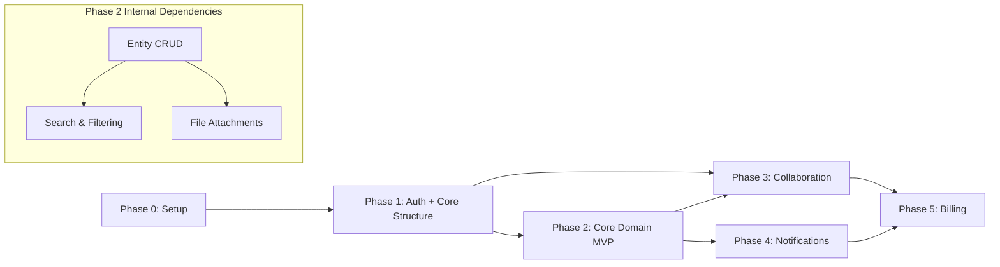

# [Application Name] — Implementation Plan

> **Purpose:** Define the phased implementation roadmap — what gets built, in what order, and what must be true before moving to the next phase. This document is the bridge between design and execution. Every phase must have clear, testable completion criteria. If you cannot verify it's done, it's not a milestone.

---

## 1. Overview

[2–3 sentences on the implementation approach. How many phases? What is the underlying philosophy — vertical slices, horizontal layers, feature flags, big bang? What is the top constraint — time, scope, or quality?]

**Total phases:** [Number]

**Delivery target:** [Date range or description — e.g., "MVP in 8 weeks, full scope in 16 weeks"]

**Team size:** [Number of engineers, roles]

**Implementation approach:** [e.g., Vertical slices — each phase delivers a usable end-to-end capability. No horizontal layers that deliver nothing to users until connected.]

---

## 2. Phase 0: Project Setup

> **Goal:** Establish the technical foundation. No feature development begins until Phase 0 is complete. A working CI/CD pipeline and deployable skeleton application are non-negotiable exits from this phase.

### 2.1 Repository and Version Control

- [ ] Initialize Git repository with agreed branching strategy (e.g., trunk-based, Gitflow)
- [ ] Define branch protection rules — main branch requires PR + review + passing CI
- [ ] Configure `.gitignore` for all tooling artifacts, secrets, and build outputs
- [ ] Add `README.md` with setup instructions and architectural overview
- [ ] Configure commit message linting (e.g., commitlint with conventional commits)

### 2.2 Project Structure

- [ ] Initialize project with chosen framework ([Framework name and version])
- [ ] Configure TypeScript / language tooling with strict settings
- [ ] Set up linting (ESLint / equivalent) with project ruleset
- [ ] Set up formatting (Prettier / equivalent) with enforced config
- [ ] Configure path aliases and module resolution
- [ ] Establish directory structure matching module design from System Design doc

### 2.3 CI/CD Pipeline

- [ ] Set up CI pipeline (e.g., GitHub Actions) that runs on every PR:
  - [ ] Lint check
  - [ ] Type check
  - [ ] Unit tests
  - [ ] Build verification
- [ ] Set up CD pipeline for staging auto-deploy on merge to main
- [ ] Set up production deploy pipeline (manual trigger with approval gate)
- [ ] Configure environment-specific secrets in CI/CD secret store
- [ ] Add pipeline status badge to README

### 2.4 Development Environment

- [ ] Document local development prerequisites (runtime versions, tools)
- [ ] Create `docker-compose.yml` for local backing services (DB, cache, queue)
- [ ] Configure environment variable management (e.g., `.env.example` with all required vars documented)
- [ ] Write `Makefile` or `package.json` scripts for common dev commands (start, test, migrate, seed)
- [ ] Verify clean `git clone` → working local environment in under 10 minutes

### 2.5 Infrastructure Setup

- [ ] Provision production and staging cloud environments
- [ ] Configure DNS and domain
- [ ] Set up TLS certificates
- [ ] Provision database (production + staging)
- [ ] Provision cache (production + staging)
- [ ] Configure object storage buckets (production + staging)
- [ ] Set up environment variable management in hosting platform

### 2.6 Observability Baseline

- [ ] Integrate error tracking (e.g., Sentry) — errors appear in dashboard
- [ ] Configure structured logging — logs visible in log aggregation tool
- [ ] Set up uptime monitoring — alert fires within 5 minutes of downtime
- [ ] Configure deployment notifications to team channel

### 2.7 Database and Schema

- [ ] Configure database connection and connection pool
- [ ] Set up migration tooling
- [ ] Create initial schema migration (all tables from Data Model)
- [ ] Verify migration runs cleanly from scratch
- [ ] Verify migration rollback works
- [ ] Create seed script for development data

### 2.8 Phase 0 Exit Criteria

- [ ] `git clone && make setup && make dev` produces a running local application
- [ ] CI pipeline runs on a test PR and all checks pass
- [ ] A trivial code change deploys to staging automatically within 10 minutes of merge
- [ ] Production environment is provisioned and accessible (even if showing placeholder)
- [ ] Database schema is applied and migrations run/rollback cleanly

---

## 3. Phase 1: [Phase Name — e.g., Authentication and Core Structure]

> **Goal:** [One sentence — what does this phase deliver to users or the system?]
>
> **Dependency:** Phase 0 complete.

### 3.1 Goals

[2–4 bullet points describing what this phase achieves from a user or system perspective.]

- [Goal 1]
- [Goal 2]
- [Goal 3]

### 3.2 Features

[List every feature or capability delivered in this phase. Be specific enough that an engineer can pick up a feature and know what to build.]

#### [Feature Area 1 — e.g., User Authentication]
- [ ] [Specific feature — e.g., Email/password registration with email verification]
- [ ] [Specific feature — e.g., Email/password login with JWT issuance]
- [ ] [Specific feature — e.g., Token refresh via HttpOnly cookie]
- [ ] [Specific feature — e.g., Logout and token revocation]
- [ ] [Specific feature — e.g., Password reset via email link]

#### [Feature Area 2 — e.g., User Profile]
- [ ] [Specific feature]
- [ ] [Specific feature]

### 3.3 Dependencies on Prior Phases

- Phase 0 complete — development environment, CI/CD, and infrastructure in place.

### 3.4 Deliverables

- [Concrete output 1 — e.g., "Working auth API: register, login, logout, refresh, password reset"]
- [Concrete output 2 — e.g., "Frontend auth flows: signup, login, logout, forgot password, reset password"]
- [Concrete output 3 — e.g., "Protected route middleware applied to all routes requiring auth"]

### 3.5 Phase 1 Exit Criteria

- [ ] [Testable criterion 1 — e.g., "A new user can register, receive a verification email, verify, and log in."]
- [ ] [Testable criterion 2 — e.g., "An unverified user cannot access any protected routes."]
- [ ] [Testable criterion 3 — e.g., "A user can reset their password and log in with the new password."]
- [ ] All Phase 1 tests passing in CI.

---

## 4. Phase 2: [Phase Name — e.g., Core Domain — MVP Feature]

> **Goal:** [One sentence.]
>
> **Dependency:** Phase 1 complete.

### 4.1 Goals

- [Goal 1]
- [Goal 2]
- [Goal 3]

### 4.2 Features

#### [Feature Area 1]
- [ ] [Specific feature]
- [ ] [Specific feature]
- [ ] [Specific feature]

#### [Feature Area 2]
- [ ] [Specific feature]
- [ ] [Specific feature]

### 4.3 Dependencies on Prior Phases

- Phase 1 complete — authenticated user session available for all features.
- [Any specific Phase 1 feature this phase depends on.]

### 4.4 Deliverables

- [Deliverable 1]
- [Deliverable 2]

### 4.5 Phase 2 Exit Criteria

- [ ] [Testable criterion 1]
- [ ] [Testable criterion 2]
- [ ] [Testable criterion 3]
- [ ] All Phase 2 tests passing in CI.

---

## 5. Phase 3: [Phase Name — e.g., Collaboration and Sharing]

> **Goal:** [One sentence.]
>
> **Dependency:** Phase 2 complete.

### 5.1 Goals

- [Goal 1]
- [Goal 2]

### 5.2 Features

#### [Feature Area 1]
- [ ] [Specific feature]
- [ ] [Specific feature]

### 5.3 Dependencies on Prior Phases

- Phase 2 complete — core domain entities and CRUD operations in place.

### 5.4 Deliverables

- [Deliverable 1]
- [Deliverable 2]

### 5.5 Phase 3 Exit Criteria

- [ ] [Testable criterion 1]
- [ ] [Testable criterion 2]
- [ ] All Phase 3 tests passing in CI.

---

*(Add additional phases as needed.)*

---

## 6. Dependency Graph

[Text-based or Mermaid diagram showing the relationships between phases and key features. Arrows show "must be completed before" direction.]

**Cross-phase dependency rules:**
- [Rule 1 — e.g., "A phase may not begin until all exit criteria of its predecessor(s) are verified in the CI pipeline."]
- [Rule 2 — e.g., "Features within a phase may be built in parallel by different engineers."]
- [Rule 3 — e.g., "Any feature that touches an unimplemented dependency must use a stub — no skipping the dependency."]

---

## 7. Risk Register

| # | Risk | Probability | Impact | Mitigation | Owner |
|---|------|------------|--------|------------|-------|
| R01 | [Risk description — e.g., "Third-party auth provider has breaking API changes"] | Low / Med / High | Low / Med / High | [Mitigation — e.g., "Pin to specific API version. Monitor changelog. Abstraction layer isolates change impact."] | [Owner — role or name] |
| R02 | [Risk] | [Prob] | [Impact] | [Mitigation] | [Owner] |
| R03 | [Risk] | [Prob] | [Impact] | [Mitigation] | [Owner] |
| R04 | [Risk] | [Prob] | [Impact] | [Mitigation] | [Owner] |
| R05 | [Risk] | [Prob] | [Impact] | [Mitigation] | [Owner] |

---

## 8. Milestones

[Milestones are binary — done or not done. Completion criteria must be verifiable, not subjective. Target dates are placeholders to be filled in based on team capacity and start date.]

| Milestone | Phase | Completion Criteria | Target Date |
|-----------|-------|--------------------|----|
| Infrastructure ready | Phase 0 | Staging environment deployed, CI/CD running, database migrated | TBD |
| Auth working end-to-end | Phase 1 | User can register, verify email, log in, and log out via the actual UI | TBD |
| [Core feature] usable by real users | Phase 2 | [Specific, testable user-facing criterion] | TBD |
| [Feature] complete | Phase 3 | [Specific, testable criterion] | TBD |
| MVP launch-ready | [Phase N] | All launch exit criteria met, load test passed, security review complete | TBD |
| [Add rows as needed] | | | |

---

## 9. Testing Strategy Per Phase

### Phase 0

- [ ] Verify CI runs successfully with a sample test
- [ ] Verify migration runs and rolls back cleanly
- [ ] Verify local dev environment setup documented and reproducible

### Phase 1

- [ ] Unit tests: Auth service — token generation, validation, refresh, revocation
- [ ] Unit tests: Input validation — all auth endpoint schemas
- [ ] Integration tests: Full auth flow — register, verify, login, refresh, logout
- [ ] Integration tests: Password reset flow end-to-end
- [ ] Coverage target: > 80% for all auth-related code

### Phase 2

- [ ] Unit tests: [Core domain] service — all business rules
- [ ] Unit tests: Data validation for all core entities
- [ ] Integration tests: CRUD operations for all core entities
- [ ] Integration tests: Permission checks — owner can access, non-owner cannot
- [ ] E2E tests: [Core user flow] — from login to completing the primary action
- [ ] Coverage target: > 80% for all Phase 2 code

### Phase 3

- [ ] Unit tests: [Phase 3 specific tests]
- [ ] Integration tests: [Phase 3 integration scenarios]
- [ ] E2E tests: [Phase 3 E2E scenarios]
- [ ] Coverage target: > 80% for all Phase 3 code

*(Extend for each phase.)*

**E2E testing tool:** [e.g., Playwright, Cypress]

**Coverage tool:** [e.g., v8/c8, Istanbul]

**Performance testing:** [e.g., k6 load test before each major milestone — target: P95 latency < 200ms at N concurrent users]

---

## 10. Definition of Done Per Phase

A phase is complete when ALL of the following are true:

### Universal (applies to all phases)

- [ ] All features in the phase are implemented and demonstrable
- [ ] All phase exit criteria are met and verified
- [ ] Unit test coverage > 80% for new code
- [ ] All tests pass in CI (no skipped or excluded tests)
- [ ] No outstanding `TODO` or `FIXME` comments in phase code
- [ ] No TypeScript errors or lint warnings in phase code
- [ ] Code reviewed and approved by at least one other engineer
- [ ] Features deployed to staging and verified working in staging
- [ ] Relevant documentation updated (API docs, README, ADRs if decisions made)

### Phase-Specific Additions

**Phase 0 additionally requires:**
- [ ] Production environment fully provisioned
- [ ] Oncall rotation and alerting configured

**Phase N (Launch) additionally requires:**
- [ ] Load test passed at expected peak traffic
- [ ] Security review complete — OWASP Top 10 addressed
- [ ] Runbook written for common operational scenarios
- [ ] Data backup and restore tested

---

## 11. Functional Requirements Coverage

[Map every functional requirement from PRD Section 7 to the phase in which it will be implemented. This ensures nothing falls through the cracks.]

| FR ID | Requirement Summary | Phase | Epic (if known) | Notes |
|-------|--------------------| ------|-----------------|-------|
| FR-001 | [Requirement description] | Phase 1 | | |
| FR-002 | [Requirement description] | Phase 2 | | |
| FR-003 | [Requirement description] | Phase 2 | | |

*(Every FR-XXX from PRD Section 7 must appear in this table. An FR with no phase is a gap that must be resolved before implementation begins.)*

---

### Change Log

| Version | Date | Author | Summary |
|---------|------|--------|---------|
| 1.0 | YYYY-MM-DD | | Initial draft |
