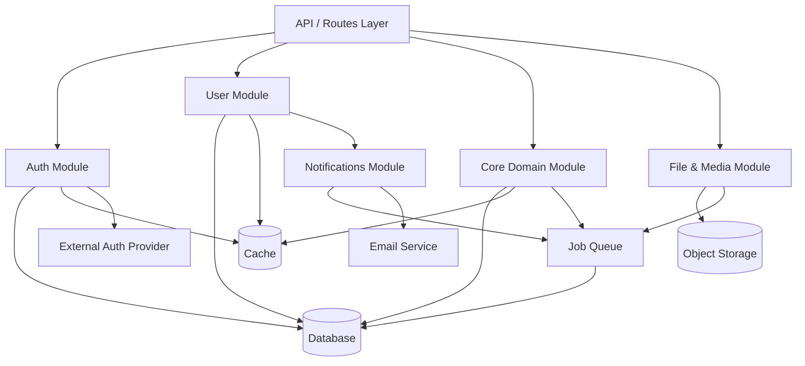

# [Application Name] — System Design

> **Purpose:** Define the internal design of the system at the module level — how the code is organized, how concerns are separated, and how the system handles state, errors, background work, events, files, and integrations. This document bridges the architecture and the implementation. It answers "how is the code structured and how does it behave?"

---

## 1. System Overview

[2–3 sentences on what this system design covers. What are the primary modules? What is the dominant design pattern — layered architecture, hexagonal, feature-based, domain-driven? What are the most important design decisions this document captures?]

**Design pattern:** [e.g., Layered architecture (routes → services → repositories), Feature-based modules, Hexagonal/ports-and-adapters]

**Module organization:** [e.g., By feature domain, by technical layer, by bounded context]

---

## 2. Module Breakdown

[Define each major module of the system. A module is a coherent unit of functionality with clear boundaries — not a file or class, but a meaningful grouping. Be specific enough that an engineer can build from this.]

### 2.1 [Module Name — e.g., User & Authentication]

**Purpose:** [What this module is responsible for, in one sentence]

**Responsibilities:**
- [Responsibility 1 — specific behavior this module owns]
- [Responsibility 2]
- [Responsibility 3]

**Interfaces (what it exposes to other modules):**
- [e.g., `createUser(email, password) → User`]
- [e.g., `validateSession(token) → Session | null`]
- [e.g., `getUserById(id) → User | null`]

**Dependencies (what it consumes from other modules):**
- [Module name — what it uses from it]
- [Module name — what it uses from it]

**Data owned:** [Entities this module is the authoritative owner of]

---

### 2.2 [Module Name — e.g., [Core Domain] Module]

**Purpose:** [What this module is responsible for]

**Responsibilities:**
- [Responsibility 1]
- [Responsibility 2]
- [Responsibility 3]

**Interfaces:**
- [Exposed function/method signatures]
- [Exposed function/method signatures]

**Dependencies:**
- [Module name — what it uses from it]

**Data owned:** [Entities owned by this module]

---

### 2.3 [Module Name — e.g., Notifications Module]

**Purpose:** [What this module is responsible for]

**Responsibilities:**
- [Responsibility 1]
- [Responsibility 2]

**Interfaces:**
- [Exposed function/method signatures]

**Dependencies:**
- [Module name — what it uses from it]

**Data owned:** [Entities owned by this module]

---

### 2.4 [Module Name — e.g., File & Media Module]

**Purpose:** [What this module is responsible for]

**Responsibilities:**
- [Responsibility 1]
- [Responsibility 2]

**Interfaces:**
- [Exposed function/method signatures]

**Dependencies:**
- [Module name — what it uses from it]

**Data owned:** [Entities owned by this module]

---

*(Add modules as needed — every significant domain area should be its own module)*

---

## 3. State Management Strategy

### 3.1 Client State

[How is client-side state managed? What lives on the client vs. the server?]

- **UI state** (e.g., modal open, selected tab): [How managed — e.g., React local state, Svelte stores]
- **Server state** (data fetched from API): [How managed — e.g., TanStack Query, SWR, manual fetch]
- **Form state**: [How managed — e.g., React Hook Form, Superforms, native]
- **Global state** (auth, user preferences, app config): [How managed — e.g., Context, Zustand, Jotai, none]
- **URL / navigation state**: [How managed — e.g., URL search params for filters and pagination]

**Principle:** [The governing principle for state — e.g., "Server is source of truth. Client state is derived or cached server state. No client-side data mutation without optimistic updates."]

### 3.2 Server State

[How is server-side state managed?]

- **Request state**: [How state is scoped per-request — e.g., request context object passed through handlers]
- **Session state**: [Where sessions live — e.g., JWT claims (stateless), server-side session store (Redis)]
- **Transactional state**: [How database transactions are managed — e.g., explicit transactions for multi-step writes]

### 3.3 Real-Time State

[If the application has real-time features, how is live state managed?]

- **Technology:** [e.g., WebSockets, SSE, long polling, polling with ETags]
- **What is real-time:** [Specific data or events that require live updates]
- **Consistency model:** [e.g., Eventual consistency acceptable, last-write-wins, CRDT]
- **Conflict resolution:** [How conflicting updates are handled]

### 3.4 Caching

See Section 4. State caching is managed at the application layer via the cache strategy below.

---

## 4. Caching Strategy

### 4.1 What to Cache

| Data | Cache Key Pattern | Rationale |
|------|------------------|-----------|
| [e.g., User profile] | `user:{id}` | [Why — e.g., Read frequently, changes infrequently] |
| [e.g., Resource list] | `resources:{userId}:list` | [Why] |
| [e.g., Config / feature flags] | `config:global` | [Why] |
| [Add rows as needed] | | |

### 4.2 TTL Policy

| Cache Type | TTL | Reasoning |
|-----------|-----|-----------|
| [e.g., User session] | [e.g., 15 minutes] | [Reasoning] |
| [e.g., Resource data] | [e.g., 60 seconds] | [Reasoning] |
| [e.g., Static config] | [e.g., 5 minutes] | [Reasoning] |

### 4.3 Invalidation Strategy

- **On write:** [What cache keys are invalidated when an entity is written — e.g., "When a user updates their profile, invalidate `user:{id}` and `user:{id}:preferences`"]
- **Pattern invalidation:** [How sets of related keys are invalidated — e.g., tag-based invalidation, key prefix scan]
- **Time-based expiry:** [When TTL-based expiry is acceptable and no explicit invalidation is needed]

### 4.4 Cache Layers

| Layer | Technology | Scope | Purpose |
|-------|-----------|-------|---------|
| CDN | [Provider] | Edge, global | [Purpose] |
| In-process | [e.g., LRU in-memory map] | Single instance | [Purpose] |
| Distributed | [e.g., Redis] | All instances | [Purpose] |
| Database | [e.g., Materialized views, query plan cache] | Database | [Purpose] |

---

## 5. Error Handling Strategy

### 5.1 Error Types

| Error Class | Meaning | HTTP Status | User-Facing? | Logged? |
|-------------|---------|-------------|-------------|---------|
| `ValidationError` | Invalid input from user | 400 | Yes | No |
| `AuthenticationError` | Not logged in | 401 | Yes | No |
| `AuthorizationError` | Logged in but not allowed | 403 | Yes | No |
| `NotFoundError` | Resource does not exist | 404 | Yes | No |
| `ConflictError` | Duplicate or state conflict | 409 | Yes | No |
| `RateLimitError` | Too many requests | 429 | Yes | No |
| `ExternalServiceError` | Upstream dependency failed | 502 | Partial | Yes |
| `InternalError` | Unexpected system error | 500 | No | Yes |

### 5.2 Error Propagation

- **Validation errors:** Caught at the request handler layer. Return 400 with field-level detail. Never propagate to caller.
- **Business logic errors:** Thrown as typed errors from service layer. Caught at handler. Never expose internal detail to user.
- **Infrastructure errors** (DB, cache, queue): Caught and wrapped as `InternalError` unless partial degradation is possible. Log with full context.
- **External service errors:** Caught, classified (transient vs. permanent), logged. If transient, retry with backoff. If permanent, return 502.

### 5.3 Error Response Format

[Every error response follows this structure:]

```json
{
  "error": {
    "code": "VALIDATION_ERROR",
    "message": "Validation failed",
    "details": [
      { "field": "email", "message": "Must be a valid email address" }
    ],
    "correlationId": "req_abc123"
  }
}
```

### 5.4 Logging on Error

Every error that is logged must include:
- Error type and message
- Stack trace
- Correlation / request ID
- User ID (if authenticated)
- Request path and method
- Any relevant entity IDs or context

**What is never logged:** PII, passwords, tokens, payment card data, secrets.

### 5.5 User-Facing Error Messages

- **Validation errors:** Show field-level messages. Be specific about what's wrong.
- **Auth errors:** Generic message — "Your session has expired. Please log in again."
- **Not found:** "This [resource] could not be found or you don't have access to it."
- **Internal errors:** "Something went wrong. Please try again or contact support." Never expose internal detail.

### 5.6 Recovery

- **Idempotency:** Mutating API endpoints that can be safely retried use idempotency keys.
- **Optimistic UI rollback:** Client-side optimistic updates are rolled back on error.
- **User guidance:** Error states include actionable next step for the user where possible.

---

## 6. Background Jobs and Async Processing

### 6.1 Job Types

| Job Name | Trigger | Frequency / Condition | Description |
|----------|---------|----------------------|-------------|
| [e.g., SendWelcomeEmail] | User created event | Once on creation | [Description] |
| [e.g., ProcessUpload] | File upload complete | Per upload | [Description] |
| [e.g., GenerateReport] | Scheduled (nightly) | Daily at 02:00 UTC | [Description] |
| [e.g., CleanupExpiredSessions] | Scheduled | Hourly | [Description] |
| [Add rows as needed] | | | |

### 6.2 Queue Configuration

- **Queue technology:** [e.g., BullMQ on Redis, SQS, Sidekiq]
- **Named queues:** [List queue names and their purpose — e.g., `email`, `media-processing`, `default`]
- **Priority:** [How job priority is handled if applicable]
- **Concurrency:** [Max concurrent workers per queue]

### 6.3 Retry Policy

- **Default retry count:** [e.g., 3 retries]
- **Backoff strategy:** [e.g., Exponential backoff — 1s, 10s, 60s]
- **Dead letter queue:** [What happens to jobs that exhaust retries — e.g., moved to DLQ, alerted on]
- **Idempotency:** [How jobs are made safe to retry — e.g., idempotency key, check-then-act pattern]

### 6.4 Monitoring

- **Job success/failure rate:** [Where this is visible]
- **Queue depth alerts:** [Threshold for alerting on queue backlog]
- **Stuck job detection:** [How jobs that are processing too long are detected]
- **Logging:** [What is logged on job start, completion, failure]

---

## 7. Events and Notifications

### 7.1 Internal Events

[Describe the internal event model — how modules communicate via events rather than direct coupling.]

| Event | Producer | Consumers | Payload |
|-------|----------|-----------|---------|
| `user.created` | Auth module | Notifications, Analytics | `{ userId, email, createdAt }` |
| `[entity].[action]` | [Module] | [Consuming modules] | [Key fields] |
| [Add rows as needed] | | | |

**Event bus technology:** [e.g., In-process EventEmitter, Redis pub/sub, message broker]

### 7.2 External Notification Channels

| Channel | When Used | Provider | Delivery Guarantee |
|---------|----------|----------|-------------------|
| Email | [When] | [e.g., Postmark] | [e.g., Best-effort, tracked via webhook] |
| Push notification | [When] | [e.g., FCM, APNs] | [e.g., Best-effort] |
| SMS | [When] | [e.g., Twilio] | [e.g., Best-effort with fallback] |
| In-app notification | [When] | Internal | [e.g., At-least-once via DB + polling] |
| Webhook | [When] | Internal | [e.g., At-least-once with retry] |

### 7.3 Notification Templates

| Notification | Channel | Template Location | Variables |
|-------------|---------|------------------|-----------|
| [e.g., Welcome email] | Email | [e.g., `templates/email/welcome.html`] | `{{ user.name }}`, `{{ verificationUrl }}` |
| [e.g., Password reset] | Email | [Path] | [Variables] |
| [Add rows as needed] | | | |

### 7.4 Delivery Guarantees

- **At-most-once:** [When this level is acceptable and what uses it]
- **At-least-once:** [When this level is required — requires idempotent receivers]
- **Exactly-once:** [When required and how achieved — typically most expensive]

---

## 8. File and Media Handling

### 8.1 Upload Flow

[Describe how files are uploaded — direct to storage, presigned URL, via API proxy, etc.]

1. [Step 1 — e.g., Client requests presigned upload URL from API]
2. [Step 2 — e.g., API validates permissions, generates presigned URL from storage provider]
3. [Step 3 — e.g., Client uploads file directly to storage using presigned URL]
4. [Step 4 — e.g., Client notifies API of completed upload with storage key]
5. [Step 5 — e.g., API enqueues processing job, updates DB record]

### 8.2 Storage

- **Provider:** [e.g., Cloudflare R2, AWS S3]
- **Bucket structure:** [e.g., `{environment}/{entityType}/{entityId}/{filename}`]
- **Access control:** [e.g., All objects private, served via presigned URLs or CDN with signed tokens]
- **Versioning:** [If object versioning is enabled and why]

### 8.3 Processing

| File Type | Processing Required | Tool / Service | Output |
|-----------|--------------------|--------------|----|
| [e.g., Image] | [e.g., Resize to multiple dimensions, generate thumbnail] | [e.g., Sharp, Cloudflare Images] | [Output format] |
| [e.g., Video] | [e.g., Transcode to HLS] | [e.g., AWS MediaConvert] | [Output format] |
| [e.g., PDF] | [e.g., Extract text, generate preview] | [e.g., pdf-parse] | [Output format] |

### 8.4 Delivery

- **How files are served to users:** [e.g., Presigned URLs with X-minute expiry, CDN with signed tokens]
- **CDN caching for media:** [TTL and invalidation strategy]
- **Download vs. inline:** [How content-disposition is set]

### 8.5 Limits and Validation

- **Allowed file types:** [MIME types and extensions — validated server-side, never trust client]
- **Max file size:** [Per file, per upload session]
- **Virus scanning:** [If applicable — when and how]
- **Quota:** [Per-user or per-account storage quota, if applicable]

---

## 9. Third-Party Integration Details

### 9.1 [Integration Name — e.g., Stripe / Payments]

**Purpose:** [What this integration does for the system]

**Authentication:** [How the system authenticates with this service — e.g., API key in request header, OAuth2]

**Data flow:**
- **Into system:** [What data comes from this service and when]
- **Out of system:** [What data is sent to this service and when]

**Key operations:**
- [Operation 1 — e.g., Create payment intent on checkout start]
- [Operation 2 — e.g., Confirm payment on form submit]
- [Operation 3 — e.g., Receive webhook for payment.succeeded]

**Error handling:**
- [How errors from this service are caught and handled]
- [What happens to the user if this service is unavailable]

**Fallback:** [What behavior exists if this integration fails — e.g., "Payment is blocked, user shown error. No silent degradation."]

**Webhooks:** [If applicable — which events are subscribed to, how they're validated (e.g., signature verification), how they're processed]

---

### 9.2 [Integration Name — e.g., Auth Provider]

**Purpose:** [What this integration does for the system]

**Authentication:** [How the system authenticates with this service]

**Data flow:**
- **Into system:** [What data comes from this service]
- **Out of system:** [What data is sent to this service]

**Key operations:**
- [Operation 1]
- [Operation 2]

**Error handling:** [How errors are handled]

**Fallback:** [Fallback behavior]

---

*(Add a section for each significant third-party integration)*

---

## 10. Module Dependency Graph

[Text-based or Mermaid diagram showing how modules depend on each other. Arrows indicate dependency direction — A → B means "A depends on B".]



**Layering rules:**
- [Rule 1 — e.g., "API layer may only call module interfaces, never directly access DB"]
- [Rule 2 — e.g., "Modules must not import from each other's internal files, only from their public interface"]
- [Rule 3 — e.g., "Infrastructure (DB, cache, queue) is always injected, never imported directly by business logic"]

---

### Change Log

| Version | Date | Author | Summary |
|---------|------|--------|---------|
| 1.0 | YYYY-MM-DD | | Initial draft |
