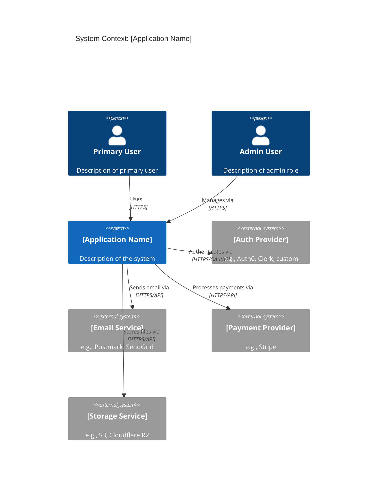
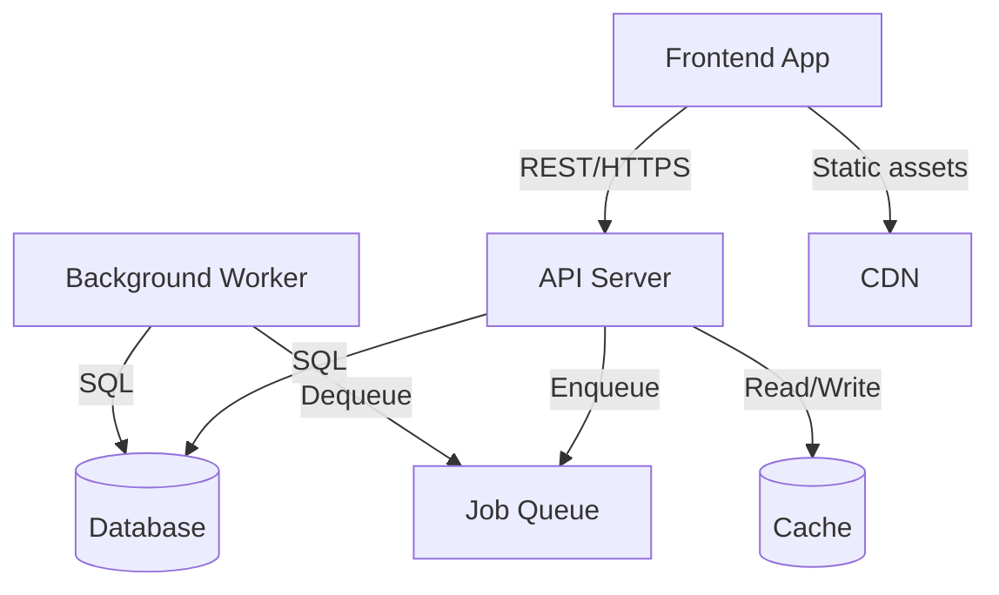
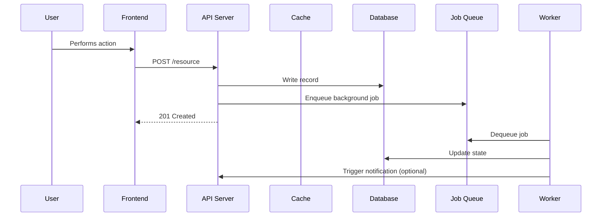

# [Application Name] — Technical Architecture

> **Purpose:** Define the complete technical architecture of the system — how it is structured, where it runs, how components communicate, and how it handles cross-cutting concerns. This document answers "how is the system built?" This is a technical reference for engineers. Every decision here should be traceable to an ADR or have a clear rationale inline.

---

## 1. System Overview

[2–4 sentences describing the system from a technical perspective. What kind of system is it? What are its primary technical characteristics — request-driven, event-driven, monolith, microservices, etc.? What are the dominant technical constraints that shaped the architecture?]

**Architecture pattern:** [e.g., Monolithic, Modular monolith, Microservices, Event-driven, CQRS, Serverless]

**Deployment model:** [e.g., Single-region cloud, Multi-region, Edge-first, Hybrid]

**Key architectural properties:**
- [Property 1 — e.g., "Stateless application tier for horizontal scaling"]
- [Property 2 — e.g., "Event-sourced writes with read model projections"]
- [Property 3 — e.g., "API-first with no server-rendered HTML"]

---

## 2. System Context Diagram

[Describe the system and its external actors. Use text or Mermaid-compatible format.]

**External actors:**

| Actor | Type | Interaction |
|-------|------|-------------|
| [Primary User] | Human | [What they do with the system] |
| [Admin User] | Human | [What they do with the system] |
| [Auth Provider] | External system | [What it provides] |
| [Email Service] | External system | [What it provides] |
| [Add rows as needed] | | |

---

## 3. Component Architecture

[Describe the major internal components of the system. For each component, describe what it does, what it owns, and how it interfaces with other components.]

### 3.1 [Component Name — e.g., API Server]

**Purpose:** [What this component is responsible for]

**Responsibilities:**
- [Responsibility 1]
- [Responsibility 2]
- [Responsibility 3]

**Interfaces:**
- Exposes: [e.g., REST API on port 3000, GraphQL endpoint, gRPC service]
- Consumes: [e.g., PostgreSQL database, Redis cache, message queue]

**Technology:** [e.g., Node.js / Express, Go / Chi, Python / FastAPI]

---

### 3.2 [Component Name — e.g., Background Worker]

**Purpose:** [What this component is responsible for]

**Responsibilities:**
- [Responsibility 1]
- [Responsibility 2]

**Interfaces:**
- Exposes: [e.g., None — pull-based consumer]
- Consumes: [e.g., Job queue (Redis/BullMQ), PostgreSQL]

**Technology:** [Technology]

---

### 3.3 [Component Name — e.g., Frontend Application]

**Purpose:** [What this component is responsible for]

**Responsibilities:**
- [Responsibility 1]
- [Responsibility 2]

**Interfaces:**
- Exposes: [e.g., Static assets served from CDN]
- Consumes: [e.g., REST API, WebSocket for real-time updates]

**Technology:** [Technology]

---

### Component Interaction Diagram

---

## 4. Infrastructure Architecture

### 4.1 Hosting

| Component | Platform | Tier / Plan | Region |
|-----------|----------|------------|--------|
| API Server | [e.g., Railway, Fly.io, AWS ECS] | [tier] | [region] |
| Frontend | [e.g., Vercel, Cloudflare Pages] | [tier] | [CDN edge] |
| Database | [e.g., Neon, PlanetScale, RDS] | [tier] | [region] |
| Cache | [e.g., Upstash Redis, ElastiCache] | [tier] | [region] |
| File Storage | [e.g., Cloudflare R2, S3] | [tier] | [region] |

### 4.2 Networking

- **Domain / DNS:** [Provider and setup — e.g., Cloudflare DNS, root domain to CDN, api.domain to API server]
- **TLS:** [How TLS is managed — e.g., Cloudflare, Let's Encrypt via cert-manager]
- **Internal networking:** [How services communicate internally — e.g., private VPC, public HTTPS with mTLS]
- **Firewall / ingress:** [What's exposed publicly vs. internally only]

### 4.3 CDN

- **Provider:** [e.g., Cloudflare, CloudFront, Fastly]
- **What's cached:** [e.g., Static assets, API responses, media files]
- **Cache invalidation:** [How cache is invalidated on deploy or content change]

### 4.4 Monitoring & Observability

| Concern | Tool | What It Covers |
|---------|------|---------------|
| Error tracking | [e.g., Sentry] | [Coverage] |
| Application performance | [e.g., Datadog, New Relic] | [Coverage] |
| Infrastructure metrics | [e.g., Grafana, CloudWatch] | [Coverage] |
| Log aggregation | [e.g., Logtail, Papertrail, Datadog Logs] | [Coverage] |
| Uptime monitoring | [e.g., Betterstack, Checkly] | [Coverage] |
| Alerting | [e.g., PagerDuty, Slack integration] | [Coverage] |

---

## 5. Data Flow

[Describe how data moves through the system for primary operations. Cover the main read path, main write path, and any async/background processing paths.]

### 5.1 Primary Write Path

[Trace a write operation from user action to persistence. Example: user submits form → API validates → writes to DB → enqueues background job → returns response → worker processes job → sends notification]

1. [Step 1]
2. [Step 2]
3. [Step 3]
4. [Continue as needed]

### 5.2 Primary Read Path

[Trace a read operation. Example: user requests data → API checks cache → cache miss → queries DB → populates cache → returns response]

1. [Step 1]
2. [Step 2]
3. [Step 3]
4. [Continue as needed]

### 5.3 Async / Background Processing

[Describe how background jobs are triggered and processed.]

1. [Step 1]
2. [Step 2]
3. [Continue as needed]

### 5.4 Data Flow Diagram

---

## 6. Security Architecture

### 6.1 Authentication Flow

[Describe the complete authentication flow from user perspective to token issuance and validation.]

1. [Step 1 — e.g., User submits credentials]
2. [Step 2 — e.g., API validates against auth provider]
3. [Step 3 — e.g., Auth provider returns JWT]
4. [Step 4 — e.g., API sets HttpOnly cookie / returns token]
5. [Step 5 — e.g., Client includes token in subsequent requests]
6. [Step 6 — e.g., API validates token signature and claims on each request]

**Token format:** [e.g., JWT RS256, opaque session token]

**Token storage:** [e.g., HttpOnly cookie, memory only — never localStorage]

**Refresh mechanism:** [e.g., Silent refresh via refresh token in HttpOnly cookie]

**Session duration:** [e.g., Access token: 15 minutes, Refresh token: 30 days]

### 6.2 Authorization

- **Model:** [e.g., RBAC, ABAC, simple ownership checks]
- **Enforcement point:** [e.g., API middleware layer, enforced on every request]
- **Permission model:** [Describe roles and what each can access]

### 6.3 Encryption

| Data State | Approach |
|-----------|----------|
| In transit | [e.g., TLS 1.2+ enforced everywhere] |
| At rest (database) | [e.g., AES-256 via cloud provider, field-level encryption for PII] |
| At rest (files) | [e.g., Server-side encryption via S3/R2] |
| Passwords | [e.g., bcrypt with cost factor 12] |
| PII fields | [e.g., Application-level encryption with rotating keys] |

### 6.4 Network Security

- **CORS:** [Policy — e.g., Allow-list of specific origins only]
- **Rate limiting:** [Strategy and limits]
- **WAF:** [If applicable — provider and rules]
- **DDoS protection:** [e.g., Cloudflare]
- **Input validation:** [Where and how inputs are validated and sanitized]
- **SQL injection prevention:** [e.g., ORM parameterized queries, no raw SQL]
- **CSRF protection:** [e.g., SameSite=Strict cookies, CSRF token]
- **Content Security Policy:** [CSP header configuration]

### 6.5 Secrets Management

- **Storage:** [e.g., Environment variables via platform secret manager, Vault, AWS Secrets Manager]
- **Rotation:** [How secrets are rotated and how often]
- **Access control:** [Who can access production secrets]
- **Never:** [e.g., No secrets in code, environment files in git, or logs]

---

## 7. Scalability Strategy

### 7.1 Horizontal Scaling

- **API tier:** [How API servers scale — e.g., Auto-scaling group, stateless so any instance handles any request]
- **Worker tier:** [How workers scale — e.g., Competing consumer pattern, scale by queue depth]
- **What cannot be horizontally scaled:** [e.g., Scheduler, anything with distributed lock]

### 7.2 Vertical Scaling

- **Database:** [When and how database is vertically scaled, read replicas]
- **Cache:** [Cache cluster sizing strategy]

### 7.3 Caching

| Layer | Technology | What's Cached | TTL | Invalidation |
|-------|-----------|--------------|-----|--------------|
| CDN | [Provider] | [Content type] | [TTL] | [Strategy] |
| Application | [e.g., Redis] | [Content type] | [TTL] | [Strategy] |
| Database | [e.g., Query cache, materialized views] | [Content type] | [TTL] | [Strategy] |

### 7.4 Database Scaling

- **Connection pooling:** [e.g., PgBouncer, application-level pool with max N connections]
- **Read replicas:** [When introduced and what reads are offloaded]
- **Partitioning / sharding:** [If applicable and when it becomes necessary]
- **Indexes:** [Index strategy — see Data Model for specifics]

---

## 8. Cross-Cutting Concerns

### 8.1 Logging

- **Format:** [e.g., Structured JSON with correlation ID, timestamp, level, service name, trace ID]
- **Levels:** [How levels (DEBUG/INFO/WARN/ERROR) are used]
- **What is always logged:** [e.g., All requests with latency, all errors with stack traces, all auth events]
- **What is never logged:** [e.g., PII, passwords, tokens, payment card data]
- **Correlation IDs:** [How requests are traced across services]

### 8.2 Error Tracking

- **Tool:** [e.g., Sentry]
- **What triggers an alert:** [e.g., New error type, error rate spike above X%]
- **Grouping strategy:** [How errors are deduplicated and grouped]
- **Context enrichment:** [What context is attached to errors — user ID, request ID, etc.]

### 8.3 Feature Flags

- **Tool:** [e.g., LaunchDarkly, Unleash, internal flag table in DB]
- **Use cases:** [What feature flags are used for — rollouts, A/B tests, kill switches]
- **Flag lifecycle:** [How flags are created, reviewed, and cleaned up]

### 8.4 Background Jobs & Queues

- **Queue technology:** [e.g., BullMQ on Redis, SQS, Sidekiq]
- **Job types:** [Categories of background work — see System Design for details]
- **Retry policy:** [Default retry count, backoff strategy, dead letter queue]
- **Monitoring:** [How job queue health is monitored and alerted on]

---

## 9. Technology Stack Summary

| Layer | Technology | Version | Justification |
|-------|-----------|---------|---------------|
| Frontend framework | [e.g., Next.js, SvelteKit, React] | [version] | [Why this was chosen] |
| API framework | [e.g., Express, Fastify, Hono, FastAPI] | [version] | [Why this was chosen] |
| Language | [e.g., TypeScript, Go, Python] | [version] | [Why this was chosen] |
| ORM / query builder | [e.g., Drizzle, Prisma, Sequelize] | [version] | [Why this was chosen] |
| Primary database | [e.g., PostgreSQL 16] | [version] | [Why this was chosen] |
| Cache | [e.g., Redis 7] | [version] | [Why this was chosen] |
| Job queue | [e.g., BullMQ, Sidekiq] | [version] | [Why this was chosen] |
| Auth | [e.g., Clerk, Auth.js, custom JWT] | [version] | [Why this was chosen] |
| File storage | [e.g., Cloudflare R2, S3] | [version] | [Why this was chosen] |
| Email | [e.g., Postmark, Resend] | [version] | [Why this was chosen] |
| Testing | [e.g., Vitest, Jest, Go test] | [version] | [Why this was chosen] |
| CI/CD | [e.g., GitHub Actions] | [version] | [Why this was chosen] |
| Hosting — API | [e.g., Fly.io, Railway, AWS] | | [Why this was chosen] |
| Hosting — Frontend | [e.g., Vercel, Cloudflare Pages] | | [Why this was chosen] |

---

## 10. Architecture Decision References

ADRs that inform or constrain this architecture:

- [ADR-XXXX: Title — what it decided and how it applies here]
- [ADR-XXXX: Title — what it decided and how it applies here]
- [ADR-XXXX: Title — what it decided and how it applies here]

---

### Change Log

| Version | Date | Author | Summary |
|---------|------|--------|---------|
| 1.0 | YYYY-MM-DD | | Initial draft |
